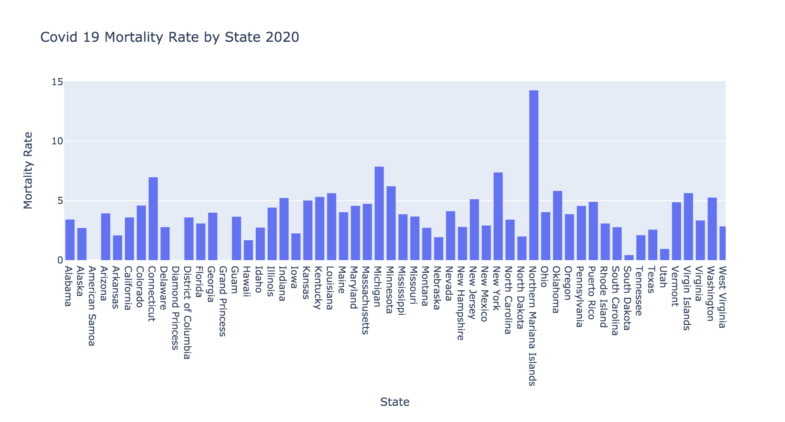

# COVID19-state-mortality-analysis

Business Question: Which US counties are the most vulnerable to the pandemic based on population characteristics and hospital bed availability? We hope to obtain a clearer picture of what factors contribute to the vulnerability of a population so that the appropriate policy actions can be taken and resources can be distributed to the counties that need them the most. 

Data Analysis and vizualization:

In the data analysis that we performed in the tutorial, we examined the correlation between contagion/resource factors and the number of COVID-19 cases per county. While this is useful in determining the spread of cases, it does not accurately assess the burden on each county. For example, counties with elderly populations may have a higher number of severe cases and deaths than a younger county with a comparable number of cases. I approached this problem by creating a bar chart of U.S. states and their respective mortality rates. This could help government and non-profit organizations determine which areas are most vulnerable to severe cases of COVID-19, and distribute life-saving resources appropriately.

Bar graph:

Business Answer Interpretation: Which Counties Should be Most Cautious as the COVID-19 Pandemic spread across the US?

In the data merging/visualizations tutorial, we created a bar graph of the 20 U.S. counties with the highest populations, bubble maps of age demographics and number of hospital beds, and a correlation heatmap. While useful in giving us a rough idea of which counties may be particularly vulnerable to the rapid spread of COVID-19, this visualization left out a lot of important information we need to answer our business question. It appeared that there were slight correlations between population size and number of cases, but there may be other factors that have a stronger correlation with a high number of cases. One factor that was not considered in this data analysis, but which may have a huge impact on the number of COVID-19 cases, is the impact of self-isolation. This could be measured in how early counties adopted quarantine policies, how strictly counties are enforcing social distancing, and how well the population adheres to these policies. Officials could use these types of analyses to determine where to designate resources, based on the expected outcome of current policies. 

Link to data sources:

https://github.com/jhu-business-analytics/covid-19-case-python-data-analysis/tree/master/original_data_files
https://raw.githubusercontent.com/CSSEGISandData/COVID-19/master/csse_covid_19_data/csse_covid_19_daily_reports/04-14-2020.csv

